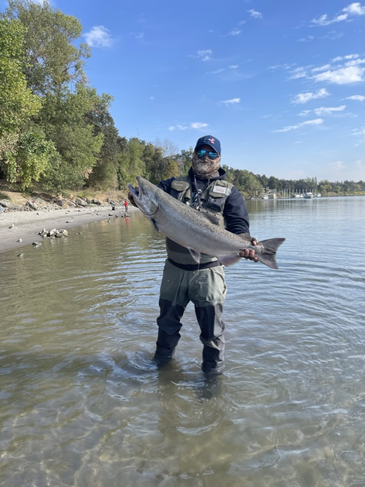

# RiverBot 🐟

A Telegram bot that reports real-time water level, flow (CFS), and temperature
for California rivers, using free USGS data (no API key required). Built for
fishing the American and Sacramento Rivers, with an eye on salmon migration.

## Features

- `/now` — current readings for all default sites (set in `.env`)
- `/river` — pick a river and reach with inline buttons, then:
  - see current level / flow / temperature
  - **📊 Compare with past years** — same calendar day, 1/3/5 years back
  - **📉 Year-over-year trend (chart)** — flow over a ±15-day window around
    today, one line per year, so you can actually see a trend instead of a
    single data point
  - **📈 7-day chart** — flow and temperature over the last week
- Daily scheduled report sent automatically at a configured time
- 🐟 Flags when water temperature drops to/below a threshold (comfortable
  range for salmon migration)
- `/language` — switch the bot's UI between English and Russian (per chat,
  saved to `lang_store.json`); Telegram's own command menu also shows
  localized command names automatically based on the user's app language
- Default sites: American River at Fair Oaks, Sacramento River at Freeport
  (edit the `RIVERS` dict in `bot.py` to add more)

## Screenshots

| Current data (`/now`) | River/reach menu (`/river`) |
|---|---|
|  |  |

| 7-day chart | Year-over-year trend |
|---|---|
|  |  |

## 1. Create the Telegram bot

1. In Telegram, message **@BotFather** → `/newbot`, pick a name.
2. Copy the token (looks like `123456789:AAAA...`) — this is `BOT_TOKEN`.
3. Send your new bot any message (`/start`).
4. Open in a browser:
   `https://api.telegram.org/bot<YOUR_TOKEN>/getUpdates`
   and find `"chat":{"id": ...}` — this is your `CHAT_ID`.
   (Or just run the bot once and send it `/start` — it replies with your
   chat_id directly.)

## 2. Install on Raspberry Pi

```bash
sudo apt update && sudo apt install -y python3-venv python3-pip

# copy the riverbot folder onto the Pi, e.g. to /home/pi/riverbot
cd /home/pi/riverbot

python3 -m venv venv
source venv/bin/activate
pip install -r requirements.txt

cp .env.example .env
nano .env   # fill in BOT_TOKEN and CHAT_ID, review sites and schedule time
```

Manual test run:

```bash
source venv/bin/activate
python bot.py
```

In Telegram, send the bot `/now` — you should get a report back. Stop with `Ctrl+C`.

## 3. Run continuously with systemd

```bash
# edit User= and the paths in riverbot.service if your Pi user isn't "pi"
sudo cp riverbot.service /etc/systemd/system/riverbot.service
sudo systemctl daemon-reload
sudo systemctl enable riverbot.service
sudo systemctl start riverbot.service

# check status
sudo systemctl status riverbot.service

# logs
tail -f /home/pi/riverbot/riverbot.log
```

The bot now starts automatically on boot and restarts if it crashes.

## Configuration (`.env`)

| Variable | Description |
|---|---|
| `BOT_TOKEN` | token from @BotFather |
| `CHAT_ID` | your chat_id (for the daily scheduled report) |
| `USGS_SITES` | comma-separated USGS site numbers (default: Fair Oaks + Freeport) |
| `SCHEDULE_TIME` | daily report time, `HH:MM` |
| `TIMEZONE` | IANA timezone, e.g. `America/Los_Angeles` |
| `SALMON_TEMP_THRESHOLD_F` | temperature threshold (°F) for the salmon-migration note |
| `DEFAULT_LANGUAGE` | `en` or `ru` — default UI language before a chat picks one with `/language` |

## Adding more rivers / reaches

Two things to edit in `bot.py`:

- `USGS_SITES` (via `.env`) — sites included in `/now` and the daily digest.
- `RIVERS` dict — the menu structure for `/river` (river name → list of
  `(reach label, USGS site number)`).

Find site numbers at https://waterdata.usgs.gov/nwis/rt.

## Updating the bot

```bash
cd /home/pi/riverbot
# replace the files with the new version, then:
sudo systemctl restart riverbot.service
```

## Security note

`.env` holds your bot token — it's already in `.gitignore` and should never
be committed. If a token ever ends up in a public repo or chat, revoke it
immediately via @BotFather (`/mybots` → your bot → API Token → Revoke) and
generate a new one.

## The reason this bot exists



*Me and my catch — king salmon, Sacramento River. I built this bot so I'd know when to be here.*
